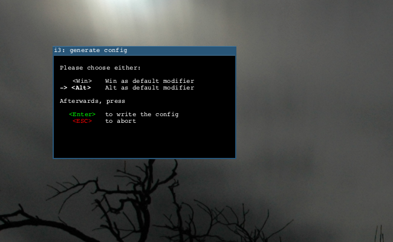
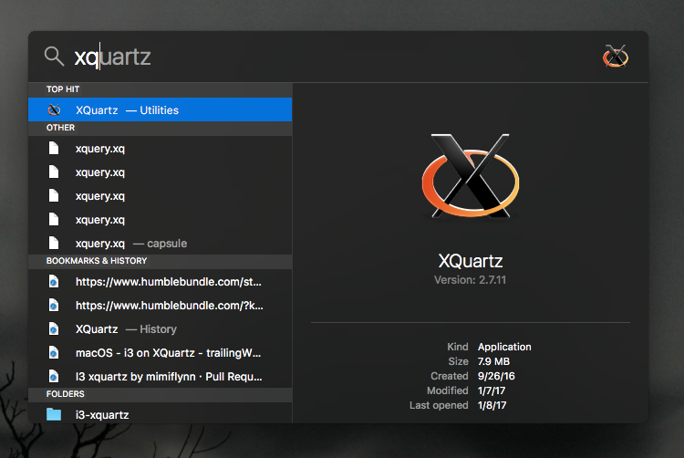

## Installing i3 on macOS

### Dependencies

[XQuartz](https://www.xquartz.org)

(Homebrew)[https://brew.sh]

### Install i3

`brew install i3`

### Configure i3 as default window manager in XQuartz

```
mkdir ~/.xinitrc.d/
touch ~/.xinitrc.d/99-wm.sh

chmod +x ~/.xinitrc.d/99-wm.sh
```

Open `99-wm.sh` in your favorite text editor and add:
```
#!/bin/sh
exec /usr/local/bin/i3
```



start xQuartz and you will see the following dialog appear from `i3-config-wizard` that runs at first start of i3.


Configure as you would any other way.
